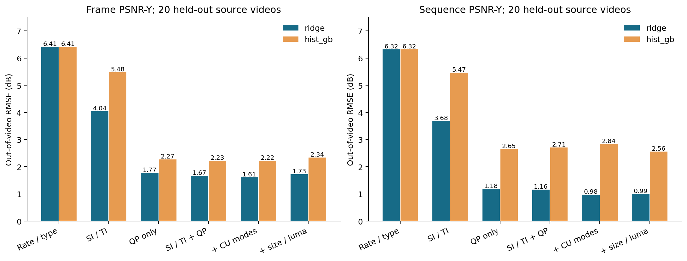
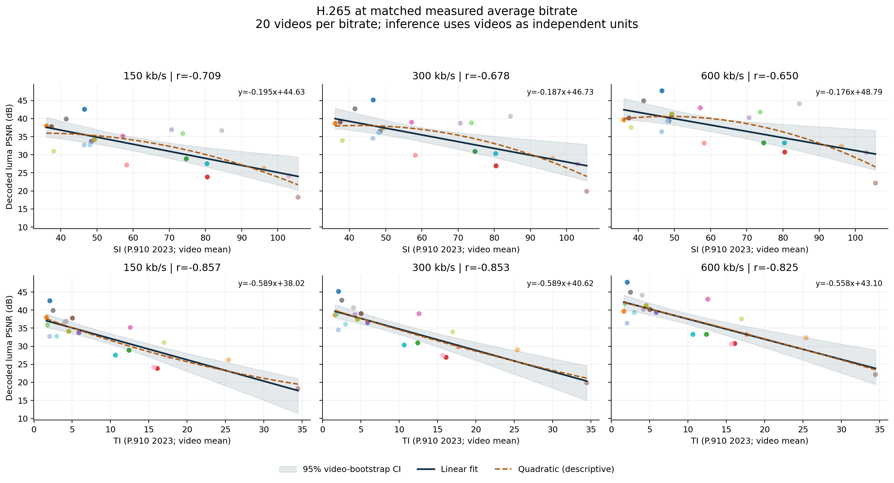

# H.265 同码率下的视频复杂度与 PSNR

基于 Xiph 公开测试视频的实际编解码实验，研究空间信息 **SI**、时间信息 **TI** 与相同平均视频码率下重建 **PSNR-Y** 的关系。

## 新增：编码侧参数预测 PSNR（2026-10-09）

已实际采集最终逐帧 **QP、CU 帧内/帧间/Skip-Merge 占比、帧类型、帧包大小与源亮度统计**。采用按源视频留出的 20 折验证，同一视频全部帧和三个码率一起留出；不把随机帧切分的结果当成跨视频能力。Ridge 的结果如下：

| 预测目标 | SI/TI 基线 RMSE dB | 加 QP + CU 占比后 RMSE dB | RMSE 降低 |
| --- | --- | --- | --- |
| 逐帧 PSNR-Y | 4.041 | **1.614** | **60.1%** |
| 全视频 PSNR-Y | 3.684 | **0.975** | **73.5%** |

主要改善来自 QP，CU 占比的额外收益尚不确定；增加包大小/亮度后未继续改善。这里的最终 QP/CU 参数用于**当前帧编码后的质量估计**，不是编码前零代价质量预报。全部 60 次日志重放编码与原码流 SHA-256 一致，避免特征和 PSNR 标签错配。

[新增完整报告](prediction/REPORT.md) · [特征定义与获取时机](prediction/FEATURES.md) · [留出预测](prediction/frame_oof_predictions.csv) · [模型与消融结果](prediction/model_metrics.csv) · [可直接使用的线性模型参数](prediction/ridge_models.json) · [验证记录](prediction/validation.json)



安装依赖后可直接复算，无需下载视频：

```powershell
python -m unittest test_metrics test_prediction -v
python predict_psnr.py
python prediction_report.py
python validate_prediction.py
```

## 原始复杂度相关性实验

**本次样本未发现正相关：三个码率下，跨视频的 SI、TI 与 PSNR 均呈统计显著负相关。** 这是对 20 个 CIF 视频、指定 x265 配置的观察结果，不能外推为所有视频或每一帧的规律。

实验日期：2026-10-08；公开整理日期：2026-10-09。

| 目标码率 kb/s | 空间 SI：Pearson r | 时间 TI：Pearson r | 同档 PSNR 最高与最低差距 dB |
| --- | --- | --- | --- |
| 150 | -0.709 | -0.857 | 24.31 |
| 300 | -0.678 | -0.853 | 25.29 |
| 600 | -0.650 | -0.825 | 25.54 |

六个主检验的 Holm 校正双侧置换 p 均小于 0.003。每档的独立样本量为 **20 段视频**，不是逐帧观测数。控制另一复杂度指标及实际码率偏差后，TI 的负关联仍显著，SI 的独立系数未显著。同视频内部逐帧 TI 系数偏正但不显著，详见完整报告。



每点是一段视频。深色实线为线性拟合，阴影为按完整视频重采样的 95% 均值置信带，橙色虚线为二次描述曲线；二次曲线不代表已验证的泛化规律。

## 报告与数据

- [完整中文报告](REPORT.md)：指标调研、计算公式、编码参数、统计检验、结果与限制。
- [独立 HTML 报告](REPORT.html)：下载后用浏览器打开，五张图已嵌入文件。
- [全部 PNG 与 SVG 图表](figures/)：序列级与逐帧散点拟合、内容覆盖、相关性稳健性、实际码率与质量审计。
- [视频级测量表](sequence_metrics.csv)：60 行，包含实际码率、SI/TI、PSNR、MSE、编码文件哈希。
- [逐帧测量表](frame_metrics.csv)：9,000 行，包含帧类型、包字节数、复杂度、PSNR 和 MSE。
- [相关检验](correlations.csv)、[联合回归](joint_regressions.csv)、[汇总 JSON](summary.json)。
- [素材来源与 SHA-256](dataset_manifest.json)、[运行环境](sources/environment.json)、[原实验验证结果](validation.json)。
- [公开版核验记录](evidence/publication_audit.json)：导出表与图的字节一致性、六个相关系数复算、码率/MSE/PSNR 汇总关系及隐私扫描。
- [最终编码命令与校准记录](evidence/final_encodes.json)、[FFmpeg 交叉验证证据](validation/)、[设计及更新记录](PLAN.md)。

## 实验设计

20 个 352×288、8-bit YUV420 视频，各取前 150 帧，统一按 30 fps 播放，保持像素及帧序列，不缩放、不插帧。共 3,000 个独有原始帧，三档码率形成 60 次最终编码、9,000 个解码帧观测。

采用 FFmpeg 8.1 / libx265 4.1+239-8be7dbf81，`medium`、`tune psnr`、两遍 ABR，固定 GOP 60。目标码率为 150、300、600 kb/s，按视频包字节数校准，全部实际平均码率误差小于 1%，最大 **0.993%**。未通过填充数据伪造相同码率。

主分析依据 ITU-T P.910 (10/2023) 的 SDR 预处理与序列平均 SI/TI；另保留经典原始亮度算法、最大值和 full-range 敏感性分析。SI 衡量 Sobel 梯度幅值的空间标准差，TI 衡量相邻亮度帧有符号差值的标准差；这里的复杂度指视频内容信息量。PSNR 从平均 MSE 换算，主指标为亮度 PSNR-Y。

每档分别进行 Pearson、Spearman、完整视频 bootstrap 5,000 次、置换 19,999 次，随机种子 `20261008`；六个主要相关检验使用 Holm 校正。逐帧图仅用于描述，补充回归按视频聚类，不将同视频的帧当作独立样本。

## 复现

### 仅复算公开测量表

需要 Python 3.12；下面的流程无需 FFmpeg 或视频下载，会重写派生统计、图表和报告。

```powershell
git clone https://github.com/qinyishcn/hevc-complexity-psnr.git
cd hevc-complexity-psnr
python -m venv .venv
.\.venv\Scripts\Activate.ps1
python -m pip install -r requirements-lock.txt
python -m unittest test_metrics -v
python analyze.py
python report.py
```

其他平台可使用对应的虚拟环境激活命令。单纯修改图表或报告无需执行编解码。

### 从原始素材重新编解码

建议在单独克隆目录执行，以免覆盖本次已发布的测量结果。安装含 `libx265`、`siti`、`psnr` 的 FFmpeg，并将 `ffmpeg`、`ffprobe` 加入 PATH。完整验证脚本按 Windows 编写，使用 `NUL` 作为空输出目标。

```powershell
ffmpeg -version
ffmpeg -encoders | Select-String libx265
python experiment.py
python enrich.py
python validate.py
python analyze.py
python report.py
```

`experiment.py` 从清单对应的 Xiph 地址下载每段视频完整前 150 帧，检查 HTTP Range，并记录源头字节 SHA-256。仅源片段约 456 MB，分块缓存和中间文件会额外占用空间。完成项通过本地 `measured.json` 缓存恢复；改变实验参数时请使用新目录。运行时间、编码字节与速度会受 x265 版本及系统影响。

`validation.json` 是**原实验**的完整验证记录，包含实际视频的哈希、格式、帧计数和独立滤镜核验；在未重新下载及编码前，不能只凭公开 CSV 再次验证视频字节或像素。公开 `validation/` 日志和命令中的实验根目录已替换为 `.`，`evidence/final_encodes.json` 的命令是取证记录，实际工作目录见相邻字段。

## 来源与使用边界

- [Xiph 测试媒体与版权链接](https://media.xiph.org/video/derf/)：公开可下载素材集合，各片段许可不统一，不应称为统一开放许可证的数据集。本库提供来源和测量结果，**不再分发原视频、重建视频或视频缩略图**。
- [ITU-T P.910 (10/2023)](https://www.itu.int/rec/dologin_pub.asp?id=T-REC-P.910-202310-S!!PDF-E&lang=e&type=items) 与 [P.910 (04/2008)](https://www.itu.int/rec/dologin_pub.asp?id=T-REC-P.910-200804-S!!PDF-E&lang=e&type=items)：用于指标定义，仅提供引用，不再分发标准全文。
- [x265 文档](https://x265.readthedocs.io/en/master/cli.html)、[FFmpeg PSNR](https://ffmpeg.org/ffmpeg-filters.html#psnr)：编码与测量工具。
- [VQEG/siti-tools](https://github.com/VQEG/siti-tools)：独立传递函数交叉验证的 MIT 参考代码，保留固定提交、SHA-256 和许可证，详见 [第三方声明](THIRD_PARTY_NOTICES.md)。

本实验只覆盖 20 个视频各自开头 5 秒、CIF、SDR、三个码率与一种软件编码配置。源文件缺少亮度范围元数据，主分析的 limited-range 假设已做 full-range 敏感性对照。PSNR 是像素保真度；结果不代表主观质量，不证明因果关系，也不直接适用于 1080p/4K、HDR、硬件 HEVC 或其他 preset。
