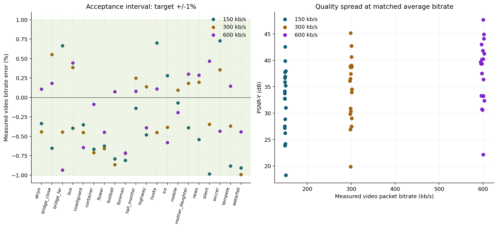
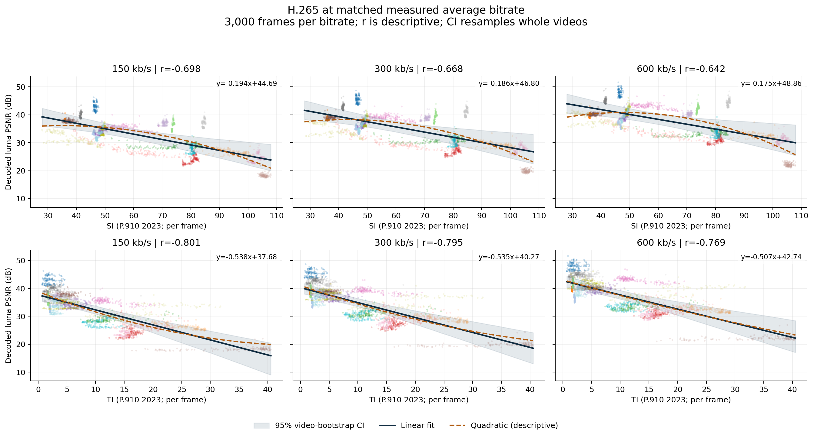
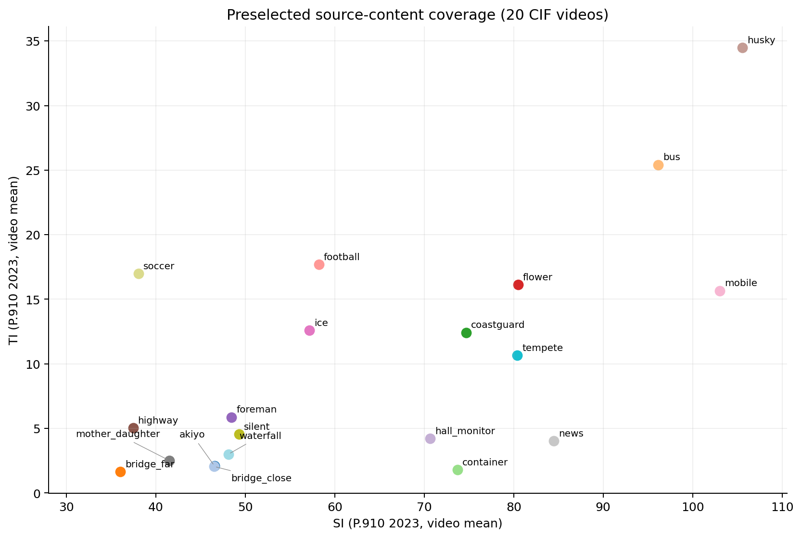
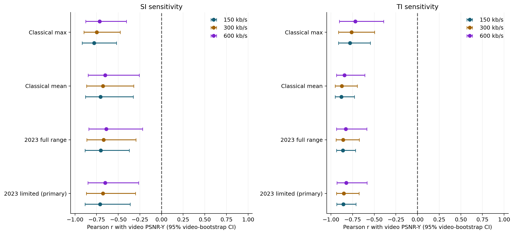

# H.265 同码率下：视频内容复杂度与 PSNR 的关系

实验日期：2026-10-08。实测 20 个公开 CIF 测试视频，每段前 150 帧；三档码率共 60 次最终编码、9,000 个解码帧观测，独有原始帧为 3,000。所有报告数字来自原始实验实际编码和解码测量；公开仓库提供测量表、哈希和验证记录，视频素材保留于原实验本地。

## 结论

**空间复杂度 SI：三个码率下均为统计显著的负相关。时间复杂度 TI：三个码率下均为统计显著的负相关。**

这回答的是“复杂度越高，重建 PSNR 是否越高”。PSNR 越高表示像素误差越小；如果讨论的是 MSE/失真而不是 PSNR，其关联方向可能相反。结论仅针对本次数据、码率范围和编码配置，是观察性关联，不是因果关系或任意 H.265 实现的定律。

**这是跨视频的总体关联。控制 SI、TI 和实际码率偏差的联合模型中，TI 的负关联仍显著，SI 的独立系数未显著。加入视频固定效应后，同一视频内部的逐帧 TI 系数偏正但不显著；不能将总体负相关说成每一帧都遵循的规律。**

## 同码率的实测结果

| 目标 kb/s | 最低 PSNR 视频 | 最低 dB | 最高 PSNR 视频 | 最高 dB | 同档差距 dB | 最大码率误差 |
| --- | --- | --- | --- | --- | --- | --- |
| 150 | husky | 18.25 | akiyo | 42.56 | 24.31 | 0.983% |
| 300 | husky | 19.86 | akiyo | 45.14 | 25.29 | 0.993% |
| 600 | husky | 22.15 | akiyo | 47.69 | 25.54 | 0.934% |

主检验使用 2023 版 P.910 流程的序列平均 SI/TI。每档独立样本 n=20，不是 3,000 帧；序列 PSNR 从全段平均 MSE 换算。

| kb/s | 指标 | Pearson r | 视频 bootstrap 95% CI | 双侧置换 p（Holm） | Spearman ρ | 正相关单侧 p（Holm） |
| --- | --- | --- | --- | --- | --- | --- |
| 150 | 空间 SI | -0.709 | [-0.884, -0.363] | 0.0014 | -0.660 | 1.0000 |
| 150 | 时间 TI | -0.857 | [-0.934, -0.711] | 3.0e-04 | -0.783 | 1.0000 |
| 300 | 空间 SI | -0.678 | [-0.870, -0.302] | 0.0027 | -0.562 | 1.0000 |
| 300 | 时间 TI | -0.853 | [-0.937, -0.676] | 3.0e-04 | -0.717 | 1.0000 |
| 600 | 空间 SI | -0.650 | [-0.852, -0.266] | 0.0027 | -0.508 | 1.0000 |
| 600 | 时间 TI | -0.825 | [-0.933, -0.583] | 4.0e-04 | -0.692 | 1.0000 |

双侧检验判断是否存在非零相关；正相关单侧检验的备择方向是 r>0。SI/TI × 三码率共六个主检验采用 Holm 校正，显著性阈值 0.05。Spearman 的对应校正结果见 correlations.csv。三档重复使用同一批视频，不构成三个独立数据集。


每点代表一段视频，三个码率分别拟合。深色实线为线性拟合，阴影为按完整视频重采样的 95% 线性均值置信带，橙色虚线为二次描述曲线。曲线不在数据覆盖范围外延伸，置信带不是单个视频预测区间。

## 指标计算方法的调研与选择

这里的时间/空间复杂度是**视频内容信息量**，不是算法的 O(n) 时间复杂度、存储空间复杂度，也不是编码耗时。采用可复算的 SI（Spatial Information，空间信息）与 TI（Temporal Information，时间信息）。

经典定义在原始亮度帧 Yₜ 上计算：

- Gₜ = √[(Sobelₓ * Yₜ)² + (Sobelᵧ * Yₜ)²]；SIₜ = std(Gₜ)。使用未归一化的 3×3 Sobel 核，边界去掉一圈像素，保留 350×286 的有效区。
- TIₜ = std(Yₜ − Yₜ₋₁)，采用全画面的有符号差值，第一帧 TI 缺失；std 是总体标准差（ddof=0）。
- 2008 版给出的整段汇总值为 maxₜ SIₜ、maxₜ TIₜ；**2023 版 7.8.4 推荐改用均值**，TI 均值的分母为 N−1。

来源：[P.910 (04/2008) 5.3、Annex A](https://www.itu.int/rec/dologin_pub.asp?id=T-REC-P.910-200804-S!!PDF-E&lang=e&type=items)、[P.910 (10/2023) 7.8、Annex B](https://www.itu.int/rec/dologin_pub.asp?id=T-REC-P.910-202310-S!!PDF-E&lang=e&type=items)。本次先读到经典公式，随后完整核查新版标准，在编码结果生成前更新了主分析口径，记录在 PLAN.md。

**主分析实现 2023 流程**：假定源视频是 8 bit SDR limited-range，将 Y 按 (Y−16)/219 转到 [0,1]，仅在复杂度计算时截断越界值；经 BT.1886 完整黑电平偏移公式映射到显示亮度，再用 BT.2100 的 PQ 变换计算 SI/TI，最后乘 255。BT.1886 参数为 Lw=300、Lb=0.01 cd/m²、γ=2.4：

L(Y) = [(Lw^(1/γ) − Lb^(1/γ)) × clip((Y−16)/219, 0, 1) + Lb^(1/γ)]^γ

PQ 常数 m₁=2610/16384、m₂=2523/32、c₁=3424/4096、c₂=2413/128、c₃=2392/128，输入归一到 10,000 cd/m²。P.910 2023 允许多种 SDR 传递函数，因此必须报告具体选择。保留的经典 SI/TI 均值、最大值不经此传递函数。

[VQEG 参考代码](https://github.com/VQEG/siti-tools)的独立 eotf_1886/oetf_pq 函数用于核对全部 256 个输入码值，最大误差 2.91e-12；本次使用完整 BT.1886 黑电平公式，**不能将数值直接与该工具默认的简化显示模型或 FFmpeg 默认 siti 结果混用**。参考代码、MIT 许可与固定提交信息位于 sources/。

SI 衡量梯度幅度的离散程度，不等于边缘总数；TI 衡量差分的离散程度，不是光流速度。空间均匀的亮度整体平移可得到 TI=0；平移/规则运动能被运动补偿预测，TI 高也不必然意味着同等比例的编码困难。

## 数据与编解码控制

素材来自 [Xiph Derf 测试集合](https://media.xiph.org/video/derf/)中的无压缩 YUV4MPEG 文件。预先选定 akiyo, bridge_close, bridge_far, bus, coastguard, container, flower, football, foreman, hall_monitor, highway, husky, ice, mobile, mother_daughter, news, silent, soccer, tempete, waterfall，未根据编码结果筛选视频。只获取每个原文件的前 150 个完整帧，未把有损预览视频当成原始数据。原始 prefix 与 30 fps reference 的 SHA256、URL、原始头字段和分块获取记录保存在 dataset_manifest.json、data/。

这是公开可下载的测试素材集合，**不是拥有统一开放许可证的数据集**。原站声明部分素材有额外限制；本次限定为本地编解码技术评估，不发布原视频。严格要求统一 CC 等开放授权的研究，应另选并完整复核同许可数据集，本次不能声称已经满足该附加条件。

所有编码输入统一为 352×288、8 bit YUV420、30 fps、5 秒。只改播放时间头字段，不缩放、不增删、不插值帧。原始头字段可能是 30000:1001 或 30:1，详见下表；原站也说明部分帧率由推断获得。TI 的跨素材解释受原始采样间隔和此播放时序约定限制。

编码器为本机 FFmpeg 8.1 的 libx265，preset medium、tune psnr；GOP=60、min-keyint=60、scenecut=0、open-gop=0、bframes=4、b-adapt=0，frame-threads=1、pools=2、info=0。帧类型核验每段 I 帧位置为 0、60、120。tune psnr 明确服务于本次像素 PSNR 目标，不能将结果直接等同于默认感知优化设置下的表现。[x265 参数说明](https://x265.readthedocs.io/en/master/cli.html)

**同码率的定义是全段实际平均视频码率相同到 ±1%**，不是每个帧都分到相同比特数，也不是每一秒的严格恒定码率：

R_actual = 8 × Σ 视频包字节数 / 5 s

使用两遍 ABR，并按实测包字节量迭代编码器目标；不通过空填充伪造等码率。不计音频和 MP4 容器开销，计入视频样本中的非图像码流开销；MP4 extradata 不计入此包口径。三个目标相当于约 0.0493、0.0986、0.1973 bit/pixel/frame。本次不模拟丢包、传输误差和 GCC 带宽变化。

逐帧 PSNR-Yₜ = 10 log₁₀(255² / MSE-Yₜ)。序列 PSNR-Y = 10 log₁₀(255² / meanₜ MSE-Yₜ)，**不是逐帧 dB 的算术平均**。附加的 PSNR-YUV 对 4:2:0 所有样本先汇总 MSE，其 Y/U/V 权重为 4/6、1/6、1/6。实际解码到原始 YUV后，按显示顺序一一比较，不将编码器自报质量当作最终测量。[FFmpeg PSNR 文档](https://ffmpeg.org/ffmpeg-filters.html#psnr)



## 逐帧结果与内容覆盖



每档 3,000 个 SI–PSNR 点、2,980 个 TI–PSNR 点，第一帧没有 TI。图中逐帧 r 仅为描述统计；阴影重采样完整视频，不独立重采样单帧。帧间预测、画面类型及率控比特分配会影响逐帧 PSNR，因此这些点不能解释为单帧在完全相同比特数下的独立编码实验。



## 稳健性与拟合解释

同一码率下改变复杂度算法/汇总方式的 Pearson r：

| kb/s | 2023 SI均值 | 经典 SI均值 | 经典 SI最大值 | 2023 TI均值 | 经典 TI均值 | 经典 TI最大值 |
| --- | --- | --- | --- | --- | --- | --- |
| 150 | -0.709 | -0.704 | -0.780 | -0.857 | -0.881 | -0.781 |
| 300 | -0.678 | -0.677 | -0.750 | -0.853 | -0.875 | -0.762 |
| 600 | -0.650 | -0.651 | -0.715 | -0.825 | -0.844 | -0.720 |

素材的 Y4M 头没有明确色彩范围标记，且 flower、bridge_close 等有较多码值超出 16–235。无法仅凭像素极值确定是 full-range 还是存在超白/超黑；因此 limited-range 主分析是一项显式假设。为此额外把所有源视频按 full-range（Y/255，不按16–235截断）重新计算 2023 SI/TI，编码与 PSNR 不变：

| kb/s | SI limited r | SI full r | TI limited r | TI full r |
| --- | --- | --- | --- | --- |
| 150 | -0.709 | -0.701 | -0.857 | -0.863 |
| 300 | -0.678 | -0.668 | -0.853 | -0.859 |
| 600 | -0.650 | -0.638 | -0.825 | -0.830 |

这一检查在发现范围标记缺失后补充，只作敏感性分析，不重新定义六个主检验或选择更显著的结果。完整 bootstrap CI 和置换检验见 correlations.csv 中的 si_2023_full_mean/ti_2023_full_mean。

本批实测在 full-range 解释下，SI/TI 的相关系数依然全部为负，且与 limited-range 主分析接近，因此亮度范围假设未改变本次关联方向。



上述敏感性比较来自同一批观测，不构成独立验证。序列级联合模型控制另一项复杂度和实际码率偏差，SI/TI 先在各码率组内标准化；系数单位为每提高一个样本标准差对应的 PSNR dB 变化。HC3 为小样本异方差稳健估计，CI 用 t 分布自由度 n−4，以下补充模型 p 值未作多重校正：

| kb/s | 自变量 | 条件系数 dB/SD | HC3 95% CI | 双侧 p（未校正） |
| --- | --- | --- | --- | --- |
| 150 | SI | -1.172 | [-3.019, +0.675] | 0.1974 |
| 150 | TI | -4.944 | [-7.153, -2.734] | 2.2e-04 |
| 300 | SI | -1.386 | [-3.166, +0.394] | 0.1183 |
| 300 | TI | -4.275 | [-5.958, -2.592] | 6.1e-05 |
| 600 | SI | -1.641 | [-3.672, +0.391] | 0.1062 |
| 600 | TI | -3.945 | [-6.114, -1.777] | 0.0014 |

线性与二次曲线的留一视频验证（每次用其余 19 段拟合、预测被留出的一个视频）：

| kb/s | 指标 | 删去任意单段后的 r 范围 | 线性 LOO RMSE dB | 二次 LOO RMSE dB |
| --- | --- | --- | --- | --- |
| 150 | SI | [-0.776, -0.626] | 4.72 | 4.77 |
| 150 | TI | [-0.873, -0.795] | 3.40 | 4.05 |
| 300 | SI | [-0.763, -0.580] | 4.97 | 4.93 |
| 300 | TI | [-0.878, -0.775] | 3.44 | 4.17 |
| 600 | SI | [-0.747, -0.539] | 5.08 | 4.90 |
| 600 | TI | [-0.861, -0.719] | 3.69 | 4.43 |

二次曲线用于观察形状；RMSE 较高意味着泛化更差，不能只看训练散点贴合程度便宣布存在可靠非线性规律。联合回归不保证消除内容类型等所有混杂。

另输出 frame_descriptive.csv（排除 I 帧的相关方向对照）与 joint_regressions.csv（视频固定效应、I/P 帧类型控制、按视频聚类的逐帧回归）。序列之间的关联与同一序列内部随时间变化的关联是两个问题，不能相互替代。

## 为什么会出现这种结果，以及可以推出什么

固定比特预算下，纹理、复杂边缘和不可预测运动往往需要更多残差信息，因而可能增加量化误差、降低 PSNR；这是对观测的机制解释，不是本实验单独证明的因果链。可重复的规则纹理、稳定运动补偿、噪声、遮挡和镜头切换都可能使 SI/TI 与实际可压缩性不完全一致。

可推出的是：在本批 CIF 片段、当前 x265 配置和三档平均码率下，表中给出的关联方向、大小与不确定性。不可直接外推到 1080p/4K、HDR、其他 preset、低延迟 IPPP、硬件 HEVC 或主观视觉质量。PSNR 是像素保真度，跨内容的 dB 差距不等同于同幅度的主观观感差距。

每个内容只取开头 5 秒，独立视频只有 20 个，且不是从明确总体中随机抽样；置信区间与置换检验依赖序列间近似独立/可交换的工作假设，不能解释成对任意互联网视频的总体置信保证。本次未作人工逐镜头边界标注，异常 TI 值可能包括镜头切换，最大值对这点尤其敏感。继续扩大实验应使用多个不重叠时段、更多来源，且以源视频而不是片段数计算有效样本量。

## 300 kb/s 档逐素材结果

| 素材 | 源头 FPS 字段 | SI2023 均值 | TI2023 均值 | 实测 kb/s | PSNR-Y dB | Y越界比例 |
| --- | --- | --- | --- | --- | --- | --- |
| akiyo | 30000:1001 | 46.560 | 2.085 | 298.67 | 45.14 | 0.224% |
| bridge_close | 30000:1001 | 46.490 | 2.057 | 301.65 | 34.52 | 23.071% |
| bridge_far | 30000:1001 | 36.027 | 1.636 | 298.67 | 38.68 | 16.864% |
| bus | 30:1 | 96.154 | 25.419 | 301.16 | 29.00 | 2.340% |
| coastguard | 30000:1001 | 74.689 | 12.420 | 298.64 | 30.90 | 1.419% |
| container | 30000:1001 | 73.703 | 1.784 | 297.87 | 38.81 | 3.048% |
| flower | 30000:1001 | 80.485 | 16.116 | 298.03 | 26.92 | 48.120% |
| football | 30:1 | 58.216 | 17.688 | 297.40 | 29.84 | 0.904% |
| foreman | 30000:1001 | 48.469 | 5.876 | 297.84 | 36.50 | 2.032% |
| hall_monitor | 30000:1001 | 70.636 | 4.218 | 300.74 | 38.73 | 6.891% |
| highway | 30000:1001 | 37.450 | 5.032 | 300.42 | 39.02 | 20.255% |
| husky | 30000:1001 | 105.553 | 34.472 | 298.65 | 19.86 | 1.261% |
| ice | 30:1 | 57.167 | 12.585 | 298.85 | 38.99 | 0.001% |
| mobile | 30000:1001 | 103.054 | 15.666 | 300.28 | 27.46 | 2.045% |
| mother_daughter | 30000:1001 | 41.518 | 2.509 | 300.55 | 42.71 | 0.293% |
| news | 30000:1001 | 84.498 | 4.034 | 300.59 | 40.63 | 2.006% |
| silent | 30000:1001 | 49.285 | 4.555 | 298.96 | 37.45 | 0.933% |
| soccer | 30:1 | 38.043 | 16.991 | 301.07 | 33.93 | 0.033% |
| tempete | 30000:1001 | 80.400 | 10.652 | 298.90 | 30.31 | 0.040% |
| waterfall | 30000:1001 | 48.096 | 2.997 | 297.02 | 36.09 | 0.883% |

越界比例只用于审计 SDR 预处理假设；编码与 PSNR 始终使用原始未截断亮度码值。

## 验证与复现

验收结果：passed，60 段编码的码率最大绝对偏差为 0.993%。所有帧数、顺序、分辨率、像素格式、原始/编码文件 SHA256、I 帧位置以及包码率和 MSE 汇总关系均通过检查。akiyo、bus、bridge_close 的 SI/TI 和逐帧 PSNR 与独立 FFmpeg 滤镜交叉一致；详见 validation.json 和 validation/。

完整重新编码流程（先按 README 安装依赖与 FFmpeg；会下载素材并覆盖结果，建议在单独克隆目录运行）：

```powershell
python -m unittest test_metrics -v
python experiment.py
python enrich.py
python validate.py
python analyze.py
python report.py
```

experiment.py 会复用本地已下载的完整字节分块与已完成的 measured.json。修改设计参数时应使用新的输出目录，以免将旧缓存混入新实验。原实验的最终编码 MP4、两遍率控统计、命令、日志与探测信息保留在本地 runs/，这些视频及率控二进制未上传公开仓库。公开 evidence/final_encodes.json 保留全部 60 次最终编码的测量、校准尝试和最终命令（实验根路径替换为点号）；validation/ 保留三段独立交叉验证的数值与脱敏日志。临时解码 YUV 在完成度量后删除，可从重新编码生成的 MP4 解码。仅复算已有统计与图表请运行 analyze.py、report.py，无需下载视频；完整 validate.py 需要先重新编码。

主要数据文件：sequence_metrics.csv（60 行，视频级）；frame_metrics.csv（9,000 行，frame 从 0 编号）；correlations.csv（主检验与经典算法对照）；joint_regressions.csv；summary.json；dataset_manifest.json；sources/environment.json。图形均提供 PNG 与可编辑 SVG。bootstrap 5,000 次、置换 19,999 次、固定随机种子 20261008。
