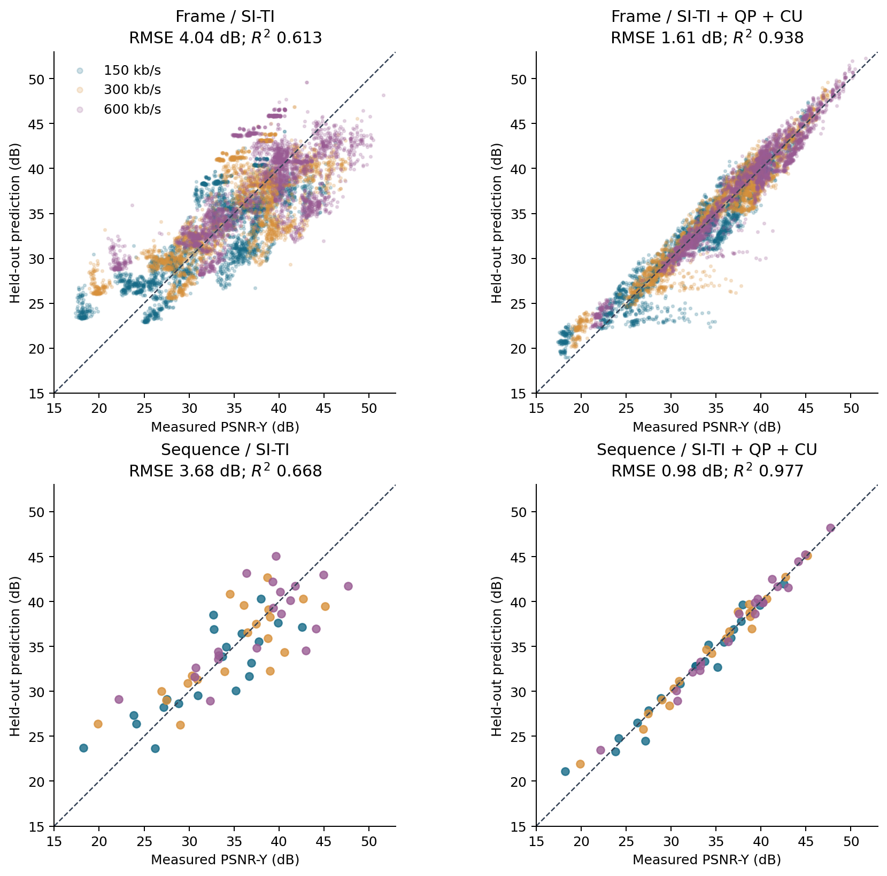
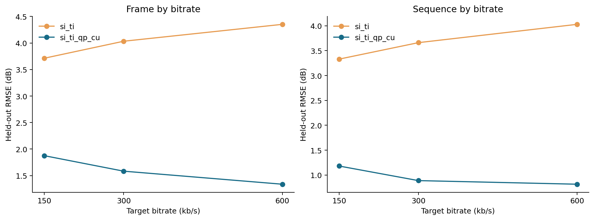
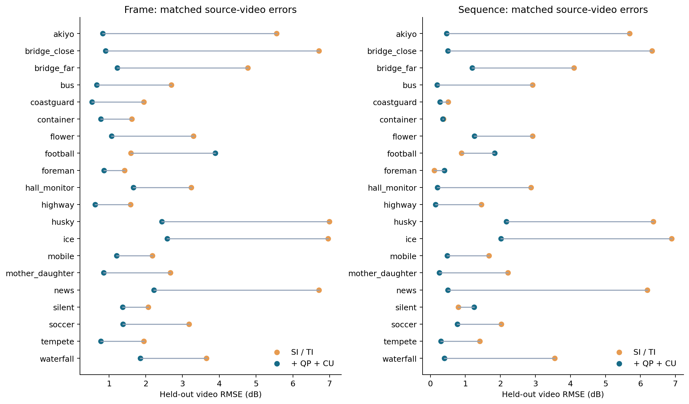

# 加入编码侧参数后的 PSNR 预测实验

日期：2026-10-09。扩展原有 20 个源视频、60 次最终编码、9,000 个逐帧测量。原始相关性实验见 [主报告](../REPORT.md)，本报告回答“使用应用编码侧易获得参数能否更准确估计 PSNR-Y”。

## 结果

**在按源视频留出的验证中，加入 QP 和 CU 预测占比后，Ridge 逐帧 RMSE 从 4.041 降到 1.614 dB，降低 60.1%；视频级从 3.684 降到 0.975 dB，降低 73.5%。** 这是在本数据中的跨视频预测改善，不是训练集拟合误差。

| 目标 | Ridge 特征 | RMSE dB | MAE dB | R² |
| --- | --- | --- | --- | --- |
| 逐帧 | 码率/帧类型 | 6.413 | 5.305 | 0.0260 |
| 逐帧 | SI/TI 基线 | 4.041 | 3.243 | 0.6133 |
| 逐帧 | QP 单独对照 | 1.775 | 1.265 | 0.9254 |
| 逐帧 | SI/TI + QP | 1.672 | 1.229 | 0.9338 |
| 逐帧 | SI/TI + QP + CU | 1.614 | 1.194 | 0.9383 |
| 逐帧 | 再加包大小/亮度 | 1.731 | 1.300 | 0.9290 |
| 视频 | 码率/帧类型 | 6.317 | 5.228 | 0.0234 |
| 视频 | SI/TI 基线 | 3.684 | 2.897 | 0.6678 |
| 视频 | QP 单独对照 | 1.178 | 0.821 | 0.9661 |
| 视频 | SI/TI + QP | 1.160 | 0.812 | 0.9670 |
| 视频 | SI/TI + QP + CU | 0.975 | 0.685 | 0.9767 |
| 视频 | 再加包大小/亮度 | 0.995 | 0.777 | 0.9758 |

SI/TI 基线也包含相同的码率、逐帧类型及 GOP 位置，因此对比没有故意削弱基线。表中的 QP 单独对照同样含这些公共参数，只去掉 SI/TI。视频级 QP 使用均值与标准差；逐帧使用当前帧平均 QP。详细输入列表见 [特征字典](FEATURES.md) 和 [模型配置](model_configuration.json)。


## 哪些参数起作用

主要改善来自 QP：只加入 QP 就已经大幅降低误差。CU 统计进一步降低点估计，但“在已有 QP 后再加 CU”的配对区间包含零，**当前样本不足以确认 CU 的独立增益稳定为正**。扩展到包大小和源亮度后，整体 RMSE 反而略升，不能认为特征越多越好。

| 目标 | 配对比较 | RMSE 降低 dB | 相对降低 | 条件 bootstrap 95% 区间 dB | 改善视频数 |
| --- | --- | --- | --- | --- | --- |
| frame | SI/TI 基线 → SI/TI + QP | +2.369 | +58.6% | [+1.390, +3.208] | 19/20 |
| frame | SI/TI 基线 → SI/TI + QP + CU | +2.426 | +60.1% | [+1.442, +3.279] | 19/20 |
| frame | SI/TI + QP → SI/TI + QP + CU | +0.058 | +3.5% | [-0.014, +0.117] | 11/20 |
| frame | SI/TI + QP + CU → 再加包大小/亮度 | -0.117 | -7.3% | [-0.346, +0.054] | 10/20 |
| sequence | SI/TI 基线 → SI/TI + QP | +2.524 | +68.5% | [+1.538, +3.408] | 17/20 |
| sequence | SI/TI 基线 → SI/TI + QP + CU | +2.709 | +73.5% | [+1.791, +3.528] | 17/20 |
| sequence | SI/TI + QP → SI/TI + QP + CU | +0.185 | +15.9% | [-0.081, +0.418] | 12/20 |
| sequence | SI/TI + QP + CU → 再加包大小/亮度 | -0.019 | -2.0% | [-0.209, +0.130] | 8/20 |

配对 bootstrap 重采样单位是整个源视频，全部码率和帧一起重采样，10,000 次，种子 20261009。区间来自固定 OOF 误差重采样，不重训练模型；外层折的训练集高度重叠，因此它是本批视频条件下的描述性不确定区间，不是完整模型选择流程的总体显著性检验。



每个点的预测来自没有见过该源视频的模型；虚线是理想 y=x。所有 9,000 帧均显示，密集点透明度用于展示，不改变有效独立视频数 20。视频级目标来自原始全片平均 MSE 换算，另建模型，未把逐帧预测 dB 平均冒充序列 PSNR。

## 数据采集与防止目标泄漏

实际重放全部 60 次最终第二遍编码，仅增加 `csv=encoder.csv:csv-log-level=2`；使用原第一遍率控文件、校准参数和输入像素。60 个新 MP4 与原编码的 SHA-256 **全部一致**，因此新特征与原始 PSNR 标签对应同一份码流。源参考文件的 20 个 SHA-256 也逐一检查。见 [采集记录](feature_collection.json)。

另外将全部 60 次编码的 CSV 平均 QP、I/P/B 各类平均 QP 与原编码 stderr 的汇总值交叉核对，差异均处于两位小数日志的舍入容差内。这避免将第一遍 QP 或错误的帧级统计混入结果。

QP 来自最终帧平均量化参数，不使用第一遍 stats 的 QP。CU 比例读取 x265 首组全帧 CU 模式计数百分比，明确不是像素面积占比；帧间总比例包含普通 Inter 和 Skip/Merge。该实现的 Skip/Merge 合计来自跳过分支，不能把 CSV Merge 名称直接解释成所有 merge 预测块。模型使用 intra 和 skip_merge 两个非冗余比例，互补的 inter 比例保留在数据表供核验。

CSV POC 在每个闭合 GOP 的 IDR 后从零开始，采集脚本恢复为全局显示顺序，并验证帧类型、帧数及一一对齐。避免把 B 帧编码顺序误配给显示顺序的 PSNR。

采用显式特征白名单。**PSNR、SSIM、MSE、重建亮度/色度失真、重建相关能量、视频名称、哈希、另一档码率质量全部不进入模型。** x265 日志提供的 Avg Luma Distortion 已含量化后的源图像与重建图像误差，若拿它“预测”PSNR 会直接泄漏目标；本实验将它排除，连采集后发布的特征表也不收录该列。原始 MSE/PSNR 仅在合并后的表中充当训练/验证标签。

## 验证设计与模型

外层采用 20 折 LeaveOneGroupOut，以源视频名称定义组。每次将某视频的所有 150 帧和三个码率全部留出；其余 19 个源视频用于训练。没有逐帧随机切分，也没有用同视频另一档码率的标签帮助预测。所有消融与算法使用同一外层划分。

Ridge 每个训练折内独立填补缺失值、拟合 StandardScaler，再在训练视频内用三折 GroupKFold 从 alpha=0.1/1/10/100 选择参数。预先固定的 HistGradientBoostingRegressor 作为传统非线性对照：150 次迭代、学习率 0.06、7 叶、L2=10，逐帧叶最少 30 样本、视频级 5；关闭随机 early stopping，未根据外层结果调参。完整记录见 [fold_audit.json](fold_audit.json)。

| 目标 | HGB 特征 | RMSE dB | MAE dB |
| --- | --- | --- | --- |
| frame | SI/TI 基线 | 5.481 | 4.436 |
| frame | QP 单独对照 | 2.271 | 1.594 |
| frame | SI/TI + QP + CU | 2.218 | 1.716 |
| frame | 再加包大小/亮度 | 2.344 | 1.866 |
| sequence | SI/TI 基线 | 5.466 | 4.469 |
| sequence | QP 单独对照 | 2.652 | 1.925 |
| sequence | SI/TI + QP + CU | 2.838 | 2.097 |
| sequence | 再加包大小/亮度 | 2.558 | 1.827 |

本次配置下 HGB 不如 Ridge，未因模型更复杂而宣称效果更好；该结果也不是对所有树模型及超参数的否定。主要比较预先设为 Ridge 的 SI/TI 与 SI/TI+QP+CU，没有以外层测试表现反复搜索模型。尚未使用新数据集做完全独立最终测试。

## 按码率和源视频观察

| 目标 | kb/s | SI/TI RMSE | +QP+CU RMSE |
| --- | --- | --- | --- |
| frame | 150 | 3.713 | 1.875 |
| frame | 300 | 4.033 | 1.584 |
| frame | 600 | 4.351 | 1.338 |
| sequence | 150 | 3.330 | 1.182 |
| sequence | 300 | 3.661 | 0.889 |
| sequence | 600 | 4.028 | 0.817 |

三个码率分别观察也都有改善。逐帧有 19/20 个留出视频改善，但 football 逐帧 RMSE 从约 1.60 上升到 3.89 dB；视频级有 17/20 改善。整体更准不代表每个视频都更准。





## 应用侧如何使用

可采用 `SI/TI + 当前帧平均 QP + 帧内 CU 比例 + Skip/Merge CU 比例 + 目标码率 + 帧类型/GOP位置`。其中 QP、CU 比例需要编码器导出统计；实际帧包大小可由应用计数，但本次额外加入后未改善主模型。普通 ffprobe 能读取帧类型和包大小，不能直接完整提供 QP/CU 分布。

这些参数适用于**当前帧编码完成后的质量估计**。QP/CU 都是最终编码决策的结果，不能据此声称已经解决编码前“选择什么参数就一定达到指定 PSNR”的问题；若用于下一帧码率决策，需要另做时间上严格因果的训练与验证。视频级聚合需要完整片段，且当前 B 帧/lookahead 设置不是低延迟配置。

导出 [ridge_models.json](ridge_models.json)，含中位数、缺失值指示列、标准化参数、系数与截距，可仅用 NumPy 执行线性公式。已检查与 sklearn 输出在数值精度内一致。导出模型用全部数据训练，只供后续新输入使用，报告的误差始终来自留出预测。这个 CPU 批量实验中，逐帧主模型推理约 0.081 微秒/行；它排除了编码、特征提取和单帧调用开销，**不代表端到端实时延迟**，详见 [耗时表](timings.csv)。

## 复现与文件

在仓库根目录安装 requirements-lock.txt 后，无需视频即可复算预测验证与图表：

```powershell
python -m unittest test_metrics test_prediction -v
python predict_psnr.py
python prediction_report.py
python validate_prediction.py
```

从原素材采集特征，需要先按主 README 完成原 60 次编码，再执行：

```powershell
python collect_prediction_features.py --experiment-root .
python predict_psnr.py
python prediction_report.py
python validate_prediction.py
```

由于跨版本 x265 可能输出不同码流，采集器对 SHA 不同会明确停止；不得静默套用旧标签。若另一个环境要复现实验，应同时重新测量标签并更新原始取证记录。本次未重新分发视频或二进制率控文件，原始 CSV 日志在忽略目录 prediction_cache/，公开的是排除泄漏字段后的特征表。

用已导出的模型对新 CSV 推理（只需所选模型的输入与行标识，不要求真实 PSNR/MSE 或未使用的包大小/亮度列）：

```powershell
python predict_psnr.py --predict new_frame_features.csv --level frame --feature-set si_ti_qp_cu --output predicted.csv
```

主要文件：encoder_features.csv（9,000 行采集特征）、frame_features.csv（与原测量合并）、sequence_features.csv（60 行）、frame_oof_predictions.csv、sequence_oof_predictions.csv、model_metrics.csv、per_video_errors.csv、paired_comparisons.csv、fold_audit.json、ridge_models.json、validation.json。图形提供 PNG 与 SVG。

## 结论边界与来源

增加可获取的编码侧参数确实降低了本批源视频留出验证的 PSNR 预测误差；QP 是主要增益来源。CU 独立增益、更多特征以及复杂模型的收益不能泛化保证。原相关性结论仍成立，这次预测改进不把 SI/TI 与 PSNR 的总体负相关改写成正相关。

独立内容仍只有 20 段，各取开头 5 秒。没有增加新的分辨率、编码器、preset 或视频总体；对新数据集、4K/HDR、硬件 HEVC、QP 统计不同的编码器，需要重新校准与外部验证。当前报告未完成在线部署或端到端延迟测试。

- [x265 日志字段官方文档](https://x265.readthedocs.io/en/master/cli.html#logging-statistic-options)。
- [本次版本 CU 计数与比例源码](https://github.com/Multicorewareinc/x265/blob/8be7dbf81/source/encoder/frameencoder.cpp)；[帧平均 QP 赋值](https://github.com/Multicorewareinc/x265/blob/8be7dbf81/source/encoder/encoder.cpp)。
- [scikit-learn 分组交叉验证](https://scikit-learn.org/stable/modules/cross_validation.html#leave-one-group-out)、[嵌套验证说明](https://scikit-learn.org/stable/auto_examples/model_selection/plot_nested_cross_validation_iris.html)。
- [Ridge](https://scikit-learn.org/stable/modules/generated/sklearn.linear_model.Ridge.html)、[HistGradientBoostingRegressor](https://scikit-learn.org/stable/modules/generated/sklearn.ensemble.HistGradientBoostingRegressor.html)。运行版本固定为 sklearn 1.8.0，精确参数见本库脚本与配置，不依赖未来文档的默认值。
